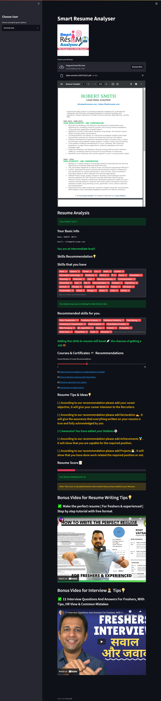
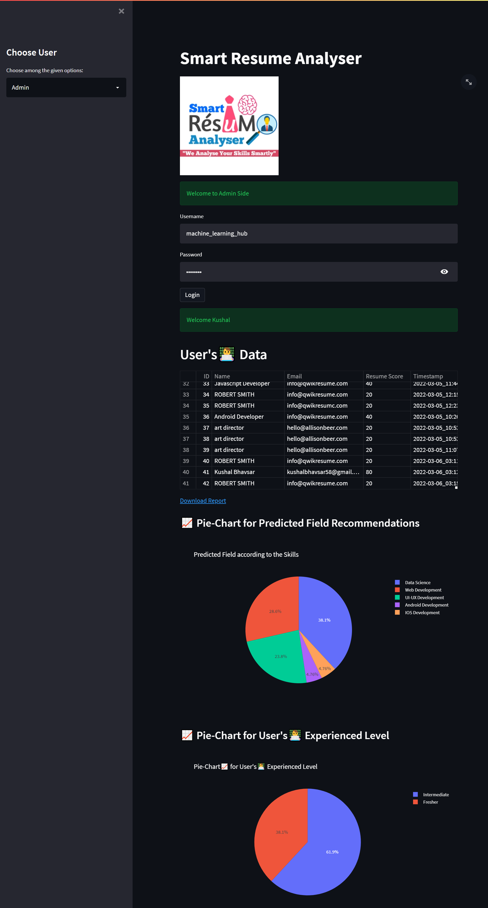

# Smart Resume Analyser


A machine learning-powered resume analysis application built with Streamlit and spaCy NLP that helps analyze, score, and improve resumes while recommending skills and courses based on detected fields.

## 📌 Features

- **Resume Text Extraction**: Extract text from PDF resumes
- **Information Extraction**: Automatically extract name, email, phone, skills and more
- **Field Prediction**: Predict the technical field of a resume (Data Science, Web Development, Android, iOS, UI/UX)
- **Skills Analysis**: Identify existing skills and recommend missing ones
- **Course Recommendations**: Suggest relevant courses based on the detected field
- **Resume Scoring**: Score resumes based on completeness and provide improvement suggestions
- **Job Description Matching**: Compare resumes against job descriptions to find matches and gaps
- **Admin Dashboard**: View analytics of processed resumes

## 📷 Screenshots




## 🔧 Technologies Used

- **Frontend**: Streamlit (Python web framework)
- **NLP**: spaCy for entity recognition and text processing
- **Database**: PostgreSQL for storing resume data
- **PDF Processing**: PyMuPDF for text extraction
- **ML**: Custom rule-based classification and matching algorithms

## 🛠️ Installation & Setup

### Prerequisites
- Python 3.8+
- PostgreSQL database
- Modern web browser

### Step 1: Clone the repository
```bash
git clone https://github.com/ChitwanRana/Smart_Resume_Analyser_App.git
cd Smart_Resume_Analyser_App
```

### Step 2: Create and activate a virtual environment
```bash
# Windows
python -m venv myenv
myenv\Scripts\activate

# Linux/Mac
python -m venv myenv
source myenv/bin/activate
```

### Step 3: Install dependencies
```bash
pip install -r requirements.txt
python -m spacy download en_core_web_sm
```

### Step 4: Configure PostgreSQL
1. Create a database named "Resume_Analyser" in pgAdmin
2. Update the database credentials in `App.py` file:
```python
DB_CONFIG = {
    "host": "localhost",
    "database": "Resume_Analyser",
    "user": 
    "password": 
    "port": "5432",
}
```

### Step 5: Run the application
```bash
streamlit run App.py
```

## 🚀 Usage

### Normal User
1. Upload your resume in PDF format
2. View the extracted information and skills
3. Get field-specific recommendations for skills improvement
4. Get recommended courses to learn the missing skills
5. See your resume score and improvement areas
6. Compare your resume with job descriptions

### Admin User
1. Access the Admin panel with credentials:
   - Username: `machine_learning_hub`
   - Password: `mlhub123`
2. View analytics on all processed resumes
3. Export data as CSV for further analysis

## 📊 Fields Supported

1. **Data Science**
2. **Web Development**
3. **Android Development**
4. **iOS Development**
5. **UI/UX Design**

## 📚 Recommended Courses

The application recommends field-specific courses from sources including:
- Udemy
- Coursera
- LinkedIn Learning
- Udacity
- YouTube tutorials
- Google Courses
- edX

## 🔗 Contributing

Contributions are welcome! Please feel free to submit a Pull Request.


